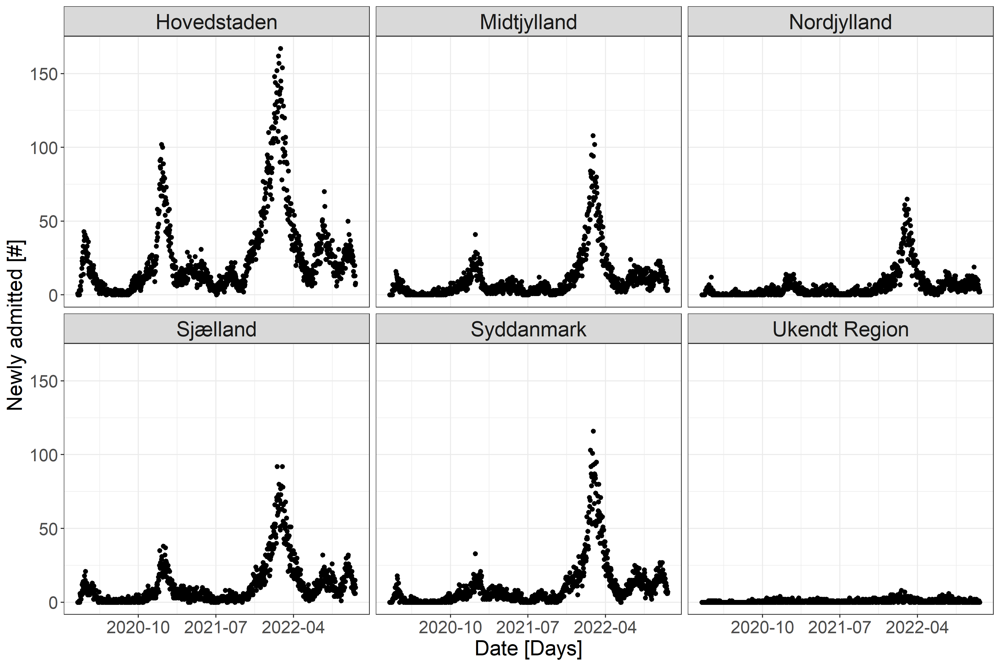
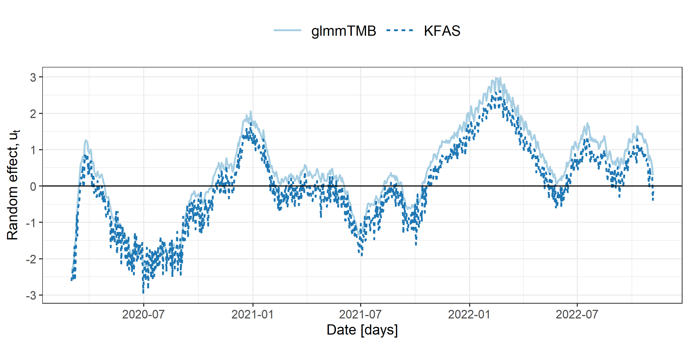
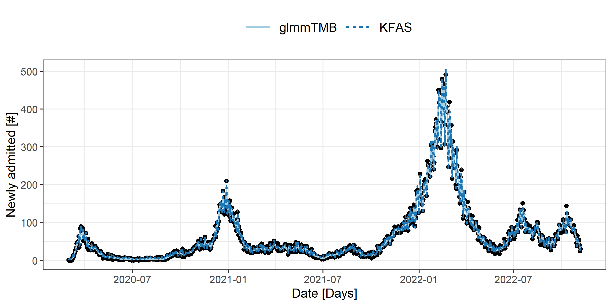
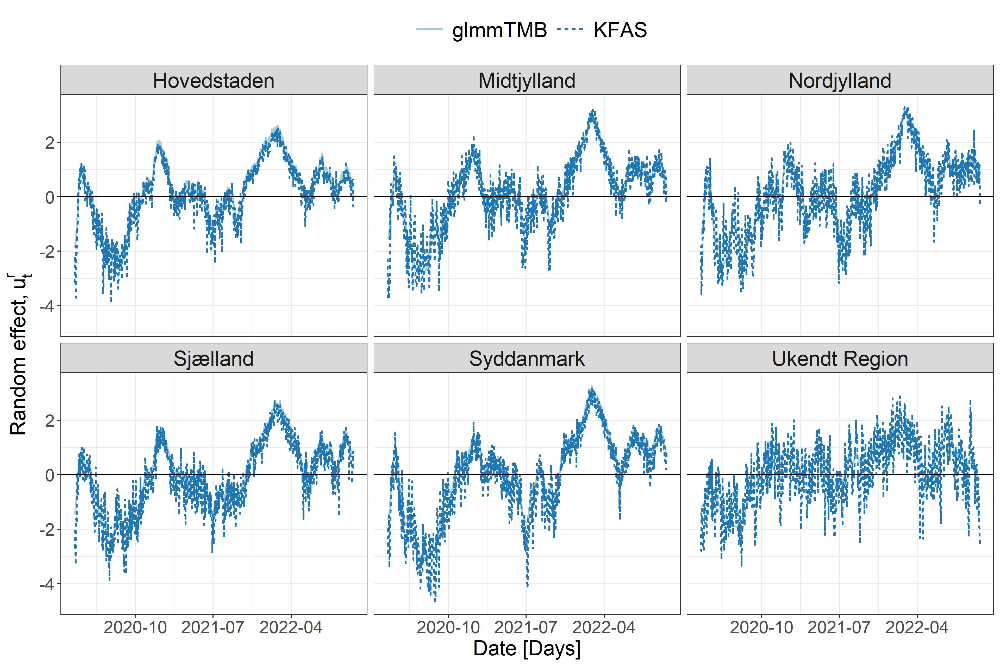
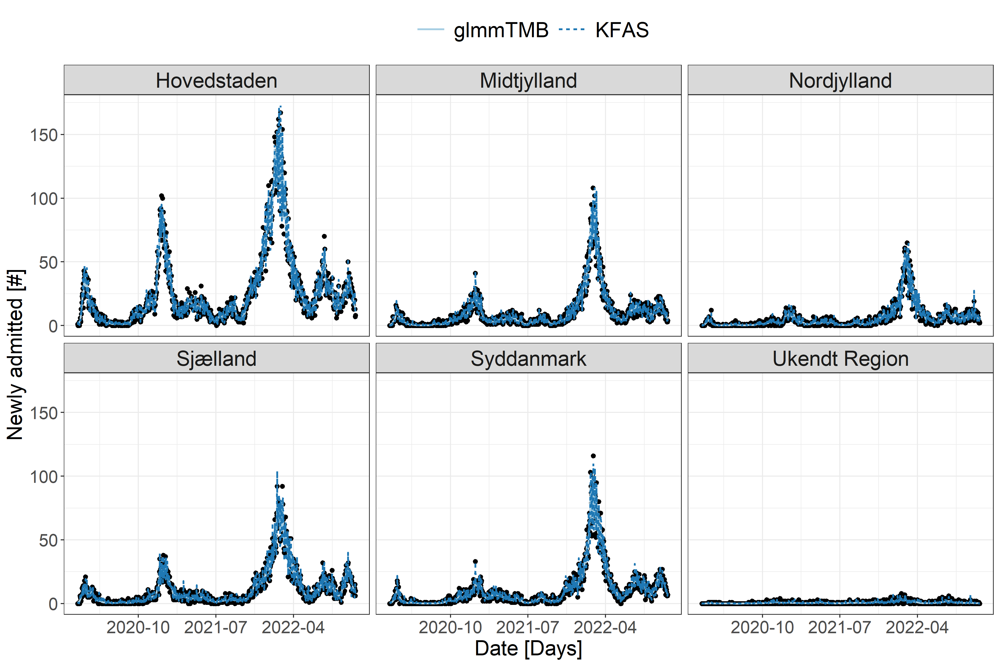
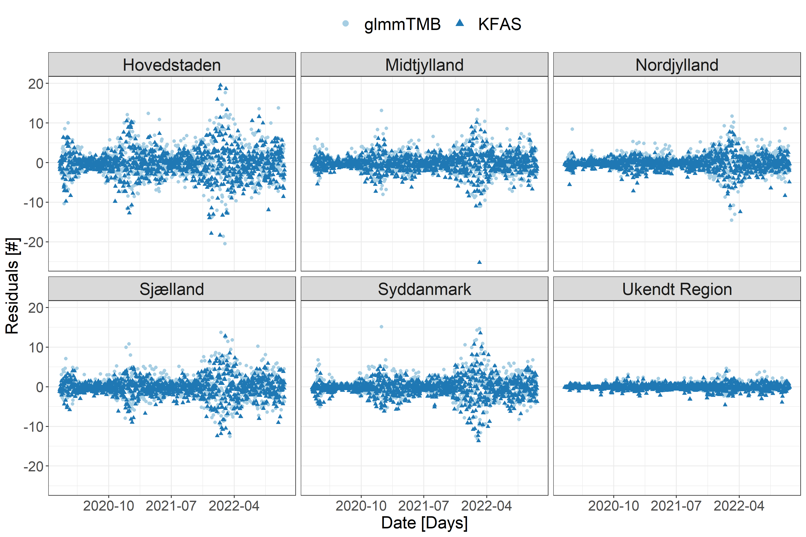
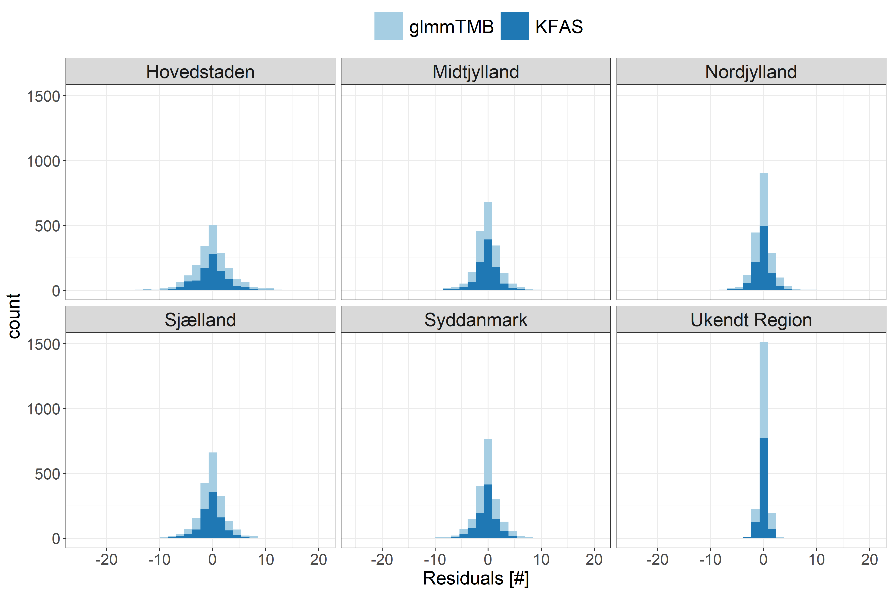
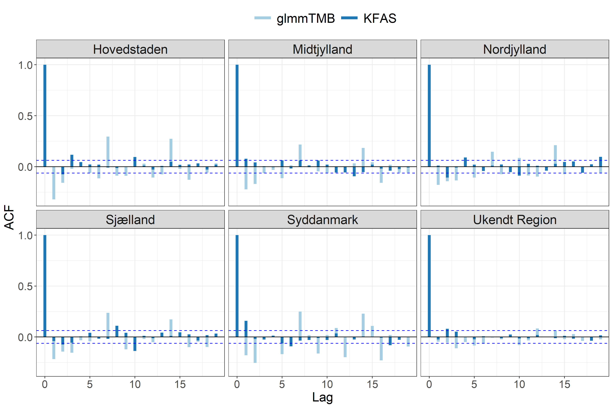

```{r setup, include=FALSE}

# Chunk settings
knitr::opts_chunk$set(echo = FALSE,
                      fig.width = 12,
                      fig.height = 6,
                      fig.align = "center",
                      out.width = "100%",
                      fig.pos = "H")

Sys.setlocale("LC_ALL","English")

# Load libraries
library(readr)
library(kableExtra)
library(KFAS)
library(glmmTMB)
library(psych)
library(dplyr)

# Number of decimals
digits <- 3

```

```{r load}
# Load processed data
newly_admitted <- read_rds(file = "./../data/processed/processed_data.rds")

n <- nrow(newly_admitted)

# Load trained models
m1.glmmTMB <- read_rds(file = "./../src/models/m1.glmmTMB.rds")
m1.out.KFAS <- read_rds(file = "./../src/models/m1.out.KFAS.rds")
m2.glmmTMB <- read_rds(file = "./../src/models/m2.glmmTMB.rds")
m2.out.KFAS <- read_rds(file = "./../src/models/m2.out.KFAS.rds")
```

\newpage

# Introduction

Early detection of outbreaks with communicable diseases are of great importance in order to initiate timely interventions and help prevent disease spread. When dealing with vast amount of data, automated procedures can supplement traditional surveillance methods, and help achieve earlier detection of the outbreak. Ultimately leading to a reduction in the size of the disease outbreak.

In this report non-normal mixed effects models is evaluated on their ability to identify outbreaks of Covid-19 disease using data over new hospital admissions with Covid-19 in Denmark. Different implementations of generalized linear mixed models (GLMMs) in R packages is compared. Namely, the `glmmTMB` [@glmmTMB] and `KFAS` [@KFAS] R packages available at Comprehensive R Archive Network (CRAN).

# Data

In this project, the daily record of new hospital admissions with Covid-19 in Denmark grouped by region of residence and totals are used. This report is based on data from `r strftime(x = newly_admitted$Dato[1], format = "%est of %B, %Y")` to `r strftime(x = newly_admitted$Dato[n], format = "%eth of %B, %Y")`. The head and tail of the processed data are listed in Table \@ref(tab:tbl).

(ref:tbl) Processed data containing the daily record of new hospital admissions with Covid-19 in Denmark grouped by region of residence and with totals. 

```{r tbl}
options(knitr.kable.NA = "...")
newly_admitted %>%
  select(Dato:Total) %>%
  headTail() %>%
  kable(digits = 2,
        format = "latex",
        booktabs = TRUE,
        longtable = TRUE,
        caption = "(ref:tbl)") %>%
  kable_styling()
```

The data is publicly available and were obtained from Statens Serum Institut (SSI) website^[https://covid19.ssi.dk/overvagningsdata/download-fil-med-overvaagningdata]. SSI collects the data from the National Patient Registry (NPR), which contains information about outpatient contacts from Danish public as well as private hospitals. The data from NPR has some delay. Therefore, the inventory is updated daily with real-time data from the regions. The regions provide snapshot-data twice to SSI daily at 7am and 3pm. A hospital admission related to Covid-19 is defined as an admission, where a patient is admitted within 14 days after a positive SARS-CoV-2 test. Patients that are tested positive for SARS-CoV-2 during an admission is also registered as a Covid-19 related admission. Furthermore, admissions with Covid-19 are only registered for patients that are present in at least one snapshot, or if the patient have been admitted for more than 12 hours according to NPR. The total number of new admissions to the hospital in Denmark are visualized in Figure \@ref(fig:admissions).

```{r admissions, fig.cap="Total number of new hospital admissions in Denmark."}

```

Clearly, the observed number of new hospital admissions are correlated in time. Consecutive epidemiological waves of Covid-19 disease have been observed, but with varying peak number of new hospital admissions. The peak number of new hospital admissions depends upon a number of influencing factors such as:

- Severity of illness
- Population in which the virus spreads
- How many are infected

Whereas the first two waves of new admissions to hospitals with Covid-19 disease can be explained by the severity of the illness and the population in which the virus spread, the large wave observed in early January, 2022, is more like likely caused by a vast amount of disease spread and the number of individuals that were infected at the same time. In this period the highly transmissible SARS-CoV-2 variant of concern, Omicron, was spreading in the population.

Denmark is grouped into five regions: *Hovestaden*, *Midtjylland*, *Nordjylland*, *Sjælland*, and *Syddanmark*. If a patient is admitted to the hospital with Covid-19, but does not reside in any of the regions, they are marked as  *Ukendt Region*. In Figure \@ref(fig:admissionsReg) the daily number of new hospital admissions grouped by region of residence is visualized.

```{r admissionsReg, fig.cap="Total number of new hospital admissions in Denmark grouped by region of residence."}

```

It can be seen that many of the new hospital admissions are linked to *Hovedstaden*, while only a negligible amount are linked to *Ukendt Region*. Intermediate amounts of new hospital admissions are linked to *Midtjylland*, *Nordjylland*, *Sjælland*, and *Syddanmark*. This is largely due to the fact, that the population size in *Hovedstaden* is larger than the other regions, and that the exposure therefore is higher in *Hovedstaden*. Additionally, a correlation between the regions are observed.

# Methodology

In this section the GLMMs for modelling the number of new hospital admissions are formulated. Moreover, methods for approximating the likelihood functions and the implementations in R packages are presented. 

## Modelling

In order to analyze the data a simple state space model is proposed. The count observations $h_t$ , $t=1,\dots,n$ in a period of $n=`r nrow(newly_admitted)`$ days starting on the`r strftime(x = newly_admitted$Dato[1], format = "%est of %B, %Y")`, of new hospital admissions is assumed to follow a Poisson distribution $h_t \sim \mathrm{P}(\lambda_t)$ with intensities given by

\begin{equation}
\label{eq:1st}
\log(\lambda_t)=\beta + u_t
\end{equation}

Here $\beta$ is considered a fixed effect parameter, that represents the average intensity, and $u_t$ is a random effect that is assumed to follow a first order auto-regressive process

\begin{equation}
\label{eq:2nd}
u_t=a u_{t-i}+\epsilon_t
\end{equation}

where $\epsilon\sim N(0,\sigma^2), t>1$ is a white noise process, and $a$ and $\sigma$ are model parameters. Using the results from @TSA, it is assumed that $u_1$ follow the stationary distribution of the first order auto-regressive process $u_1\sim N(0,\sigma^2/(1-a^2))$. Hence the joint likelihood becomes

\begin{equation}
\label{eq:jl}
L(a,\beta,\sigma; \mathbf{u}, \mathbf{y})=\phi_{0,\frac{\sigma^2}{1-\sigma^2}}(u_1) \prod_{t=2}^n\big(\phi_{0,\sigma^2}(u_t-au_{t-1})\big) \prod_{t=1}^n \big(p_{\lambda_t}(h_t)\big)
\end{equation}

where $\phi_{\mu,\sigma^2}$ is the probability density function (pdf) of the normal distribution with mean $\mu$ and variance $\sigma_2$, and $p_\lambda$ is the pdf of the Poisson distribution with mean $\lambda$. Intuitively, the model can be extended by modelling the individual regions. Hence, $(a, \beta, \sigma)$ are 6-dimensional vectors.

In order to obtain the likelihood for the model parameters $(a, \beta, \sigma)$ the observed random effects are integrated out. Hence, the marginal likelihood is obtained

\begin{equation}
\label{eq:ml}
L_M=(a, \beta, \sigma;\mathbf{y})= \int_{	\mathbb{R}^{q}}L(a, \beta, \sigma;\mathbf{u}, \mathbf{y})d\mathbf{u}
\end{equation}

where $q$ is the number of random effects and $a$, $\beta$, and $\sigma$ are the parameters to be estimated.

In order to make computation of the joint likelihood function in \@ref(eq:ml) fseasible, the estimation is carried out using the multivariate Laplace approximation.

### Laplace approximation

The marginal log-likelihood $l_{M}(a, \beta,\sigma; \mathbf{y})=\log(L_M(a,\beta,\sigma;\mathbf{y}))$ is approximated by a second order Taylor approximation around the optimum $\mathbf{\tilde{u}}=\mathbf{\hat{u}}_\theta$ of the log-likelihood function w.r.t. the unobserved random variables $\mathbf{u}$, i.e.,

\begin{equation}
\label{eq:LA}
l(a, \beta, \sigma; \mathbf{u}, \mathbf{y})\approx l(a, \beta, \sigma;\mathbf{\tilde{u}, \mathbf{y}}) - \frac{1}{2}(\mathbf{u}-\tilde{\mathbf{u}})^T H(\mathbf{\tilde{u}})(\mathbf{u}-\tilde{\mathbf{u}})
\end{equation}

where the first-order term of the Taylor expansion disappears since the expansion is done around the optimum $\tilde{\mathbf{u}}$ and $H(\tilde{\mathbf{u}})=-l_{uu}^{''}(a, \beta, \sigma,\mathbf{u},\mathbf{y})|_{\mathbf{u}=\tilde{\mathbf{u}}}$ is the negative Hessian of the joint log-likelihood evaluated at $\tilde{\mathbf{u}}$.

Using the approximation in \@ref(eq:LA) on \@ref(eq:ml) the Laplace approximation of the marginal log-likelihood becomes (See @glmm)

\begin{align}
l_{M,LA}(a,\beta,\sigma;\mathbf{y})&=\log\int_{\mathbb{R}^q}\exp\big(l(a,\beta,\sigma;\mathbf{\tilde{u}}, \mathbf{y})-\frac{1}{2}(\mathbf{u}-\mathbf{\tilde{u}})^T H(\mathbf{\tilde{u}})(\mathbf{u}-\mathbf{\tilde{u}}) \big) d\mathbf{u} \\
&=l(a,\beta,\sigma;\mathbf{\tilde{u}}, \mathbf{y})-\frac{1}{2}\log\Bigg|\frac{H(\mathbf{\tilde{u}})}{2\pi}\Bigg|
\end{align}

### Importance sampling

Importance sampling is a re-weighting technique for approximating integrals w.r.t. a density *f* by simulation in cases where it is not feasible to simulate from the distribution with density *f*. Instead it uses samples from a different distribution with density *g*, where the support of *g* includes the support of *f*.

## Parameter estimation

In this section two R packages for used to estimate the parameters are presented. Namely, `glmmTMB` and `KFAS` which are available at CRAN. 

### glmmTMB

This section describes the R package `glmmTMB` by @glmmTMB for linear and GLMMs using Template Model Builder (TMB). The models are estimated using maximum likelihood estimation via TMB. Random effects are assumed to be Gaussian on the scale of the linear predictor and are integrated out using Laplace approximation. Additionally, gradients are calculated using automatic differentiation.

### KFAS

This section goes into detail with the R package `KFAS` by @KFAS for state space modelling with observations from the exponential family. The `KFAS` package can perform Kalman filtering and smoothing with exact diffuse initialization using an univariate approach.

In `KFAS` the Poisson distribution with intensity $\lambda_t$ and exposure term $e_t$ together with the log-link is supported. Thus we have $\E\big(h_t|\log(\lambda_t)\big)=\V\big(h_t|\log(\lambda_t)\big)=e_t\lambda_t$. In this report the exposure term is assumed to be constant, i.e. $e_t=1$. Hence, the differences in time and between the regions are represented directly in the estimated parameters and latent state.

In order to make inferences of the Poisson model, `KFAS` finds a Gaussian model with the same conditional posterior mode as $\mathrm{P}(\lambda|\mathbf{h})$. This is done trough an iterative process with Laplace approximation of $\mathrm{P}(\lambda|\mathbf{h})$, where the updated estimates of $\log(\lambda_t)$ are computed via the Kalman filtering and smoothing from the approximating Gaussian model. The final estimates of $\log(\hat{\lambda}_t)$ correspond to the mode of $\mathrm{P}(\lambda|\mathbf{h})$. Generally, the difference between the mode and the mean is negligible. Nevertheless, our interest is focused on the intensity $\lambda_t$ rather than the linear predictor $\log(\lambda_t)$. 

Direct transformation from the linear predictor to the intensity introduces some bias. To solve this problem `KFAS` also contains methods based on importance sampling.

# Results

In this section the obtained estimates for the fixed- and random effects are presented. Additionally, the model residuals are evaluated.

## Estimating the total number of new hospital admissions in Denmark

```{r intensities}
glmmTMB.summary <- summary(m1.glmmTMB)
glmmTMB.beta.est <- round(glmmTMB.summary$coefficients$cond[1],digits)
glmmTMB.beta.std <- round(glmmTMB.summary$coefficients$cond[2],digits)
KFAS.beta.est <- round(as.numeric(coef(object = m1.out.KFAS, last = TRUE)[1]), digits)
KFAS.beta.std <- round(sqrt(m1.out.KFAS$V[1,1,n]), digits)

glmmTMB.beta <- paste0(glmmTMB.beta.est," (",glmmTMB.beta.std,")")
KFAS.beta <- paste0(KFAS.beta.est," (",KFAS.beta.std,")")

```

The average intensity, $\beta$, estimates from `glmmTMB` and `KFAS` is listed in Table \@ref(tab:parTbl) together with the standard deviation of the random effect residuals, $\sigma$. It can be seen that the average intensity, $\beta$ is estimated to be `r glmmTMB.beta` and `r KFAS.beta` using `glmmTMB` and `KFAS` respectively. It is noted that the standard deviation of the estimate from `glmmTMB` is rather high, and that the estimate from `KFAS` lies within one standard deviation from the `glmmTMB` estimate. The standard deviation of the estimate from `KFAS` is rather low, which is because the `KFAS` R package contains methods based on importance sampling.

The estimated average number of new hospital admissions considering only the fixed effect is `r round(exp(glmmTMB.beta.est), digits)` and `r round(exp(KFAS.beta.est), digits)` for `glmmTMB` and `KFAS` respectively. There is a noticeable difference between these two estimates of $\beta$, which comes down to the fact that `glmmTMB` and `KFAS` utilize different methods for parameter estimation.

As an example, the likelihood computation in `KFAS` is an iterative procedure which is stopped using som stopping criteria, so the log-likelihood function contains some noise. This can affect the gradient computations in methods like the Broyden-Fletcher-Goldfarb-Shanno (`BFGS`), which is used in this report, and can in theory give unreliable results. Therefore, using a derivative free method like Nelder-Mead can be recommended, even though it is not as computationally efficient.

(ref:parTbl) Smoothed parameter estimates for the GLMM given in \@ref(eq:1st) and \@ref(eq:2nd) obtained using the `KFAS` and `glmmTMB` R packages. The standard deviation of the estimate is given in the parantheses. A method for calculating $\sigma$ in non-Gaussian models is not supported in `KFAS`.

```{r parTbl}

glmmTMB.sigma <- paste0(round(attr(x = glmmTMB.summary$varcor$cond$group, which = "stddev")[1],digits))

parTbl <- data.frame(Parameter = c("$\\beta$", "$\\sigma$"),
                     glmmTMB = c(glmmTMB.beta, glmmTMB.sigma),
                     KFAS = c(KFAS.beta, NA_character_))

kable(parTbl,
      digits = 2,
      format = "latex",
      col.names = c("Parameter", "glmmTMB", "KFAS"),
      booktabs = TRUE,
      longtable = TRUE,
      escape = FALSE,
      caption = "(ref:parTbl)")

```

The smoothed estimate of the random effects, $u_t$, from `glmmTMB` and `KFAS` is visualized in Figure \@ref(fig:latentState). It can be seen that the estimate of $u_t$ is comparable using the two methods, but that `KFAS` consistently estimates $u_t$ lower than `glmmTMB`. This is likely because `KFAS` estimated $\beta$ to be a bit higher than `glmmTMB` and that the correlation between these two parameter estimates are rather high. Additionally, it is noted that as $u_t>0$ the intensity is above the average intensity, and the number of new hospital admissions is above the estimated average, while as $u_t<0$ the opposite is true. The signal is connected to the expected value via the log-link function. Thus the number of new hospital admissions, $h_t$, increases exponentially with $u_t$.

(ref:latentState) Smoothed estimates of the latent states from `glmmTMB` and `KFAS`.

```{r latentState, fig.cap="(ref:latentState)"}

```


In Figure \@ref(fig:admittedPred) the smoothed estimates from `glmmTMB` and `KFAS` of the total number of new hospitals admissions in Denmark is visualized. There are no observable difference between the two implementations of the model.

(ref:admittedPred) Smoothed estimates from `glmmTMB` and `KFAS` of the total number of new hospital admissions in Denmark.

```{r admittedPred, fig.cap="(ref:admittedPred)"}

```

Diagnostic plots of the one-step prediction residuals for the total number of new hospital admissions in Denmark are visualized in Figure \@ref(fig:diagnosticRes). Overall the plots hint that the model can be improved. In A) and B) a significant auto-correlation in the residuals are detected. This is likely caused by the increased variance in the number of new admissions during the Covid-19 waves. The two lower plots, C) and D), indicate heavy tailed residuals.

(ref:diagnosticRes) Diagnostic plots of the observed number of new hospital admissions in a specific regions minus the predicted number of new hospital admissions using `glmmTMB` and `KFAS`. A) Time series of the residuals, B) Auto-correlation function of the residuals, C) Histogram of the residuals, and D) Quantile-Quantile plot of the residuals.

```{r diagnosticRes, fig.cap="(ref:diagnosticRes)"}

```

## Estimating the number of new hospital admissions in Denmark grouped by region

```{r intensitiesReg}

glmmTMB.reg.summary <- summary(m2.glmmTMB)
beta.tot <- glmmTMB.reg.summary$coefficients$cond[,1]

glmmTMB.reg.beta <- paste0(round(beta.tot,digits)," (",
                           round(glmmTMB.reg.summary$coefficients$cond[,2],digits),")")

beta.hov <- beta.tot[1]
beta.hov.round <- round(beta.hov,digits)

beta.hov.perc <- round(exp(beta.hov)/sum(exp(beta.tot)), digits)*100

glmmTMB.reg.sigma <- paste0(round(attr(x = glmmTMB.reg.summary$varcor$cond$region, which = "stddev")[1],digits))

KFAS.tot <- as.numeric(coef(object = m2.out.KFAS, last = TRUE)[1:6])
KFAS.hov <- KFAS.tot[1]
KFAS.hov.round <- round(KFAS.hov,digits)

KFAS.hov.perc <- round(exp(KFAS.hov)/sum(exp(KFAS.tot)), digits)*100

KFAS.reg.beta <- paste0(round(KFAS.tot, digits),
                    " (", round(sqrt(diag(m2.out.KFAS$V[,,n])),digits)[1:6],")")


```

In this section the GLMM given in \@ref(eq:1st) and \@ref(eq:2nd) is extended, such that the individual regions are modeled. Hence, the fixed effect parameter, $\mathbf{\beta}$, is a 6-dimensional vector, $\mathbf{\beta}^T=\big[\beta_\text{Hov}, \beta_\text{Mid},\beta_\text{Nor},\beta_\text{Sjæ},\beta_\text{Syd},\beta_\text{Uke}\big]$, the random effects vary independently for each region, $u_t^{r}$,  $r=\big[\text{Hov, Mid, Nor, Sjæ, Syd, Uke}]$. The same white noise process, $e\sim N(0,\sigma^2)$, is assumed for all the regions.

The average intensity, $\mathbf{\beta}$, estimates from `glmmTMB` and `KFAS` is gathered in Table \@ref(tab:parTblReg) together with the standard deviation of the random effect residuals, $\sigma$. It can be seen that the average intensity in *Hovedstaden*, $\beta_\text{Hov}$, is estimated to be `r beta.hov.round` and `r KFAS.hov.round` using `glmmTMB` and `KFAS` respectively, which is the highest among the regions and corresponds to between `r beta.hov.perc`-`r KFAS.hov.perc`\% of of the average number of new hospital admissions. This is expected, as the exposure term is fixed to 1 in this report, and the difference in the population size between the regions is therefore observed within the parameter estimates. 

As before, the uncertainty on the parameter estimates is higher using `glmmTMB` than `KFAS`, but this time some of the estimates for the average intensity lies within one standard deviation of each other for both `glmmTMB` and `KFAS`, and for $\beta_\text{Nor}$ the maximum likelihood estimate is the same.

(ref:parTblReg) Smoothed parameter estimates for the extended GLMM given in \@ref(eq:1st) and \@ref(eq:2nd) obtained using the `KFAS` and `glmmTMB` R packages. The standard deviation of the estimate is given in the parantheses. A method for calculating $\sigma$ in non-Gaussian models is not supported in `KFAS`.

```{r parTblReg}

reg <- c("Hov", "Mid", "Nor", "Sjæ", "Syd", "Uke")
parTblReg <- data.frame(Parameter = c(paste0("$\\beta_\\text{",reg,"}$"), "$\\sigma$"),
                        glmmTMB = c(glmmTMB.reg.beta,glmmTMB.reg.sigma),
                        KFAS = c(KFAS.reg.beta, NA_character_))

kable(parTblReg,
      digits = 2,
      format = "latex",
      col.names = c("Parameter", "glmmTMB", "KFAS"),
      booktabs = TRUE,
      longtable = TRUE,
      linesep = "",
      escape = FALSE,
      caption = "(ref:parTblReg)")
```

In Figure \@ref(fig:latentStateRegPred) the random effects, $u_t^r$, $r=\big[\text{Hov, Mid, Nor, Sjæ, Syd, Uke}]$ is visualized. Obviously, a correlation between the regions is observed, which is expected as individuals residing in one region is not contained within that region and can spread disease to other regions as well. Hence, when an outbreak happens in one region it can leak into the adjacent regions. 

(ref:latentStateRegPred) Smoothed estimates of the latent states from `glmmTMB` and `KFAS`.

```{r latentStateRegPred, fig.cap="(ref:latentStateRegPred)"}

```

In Figure \@ref(fig:admittedRegPred) the smoothed estimate from `glmmTMB` and `KFAS` of the total number of new hospitals admissions in Denmark grouped by region is visualized. The difference between the two implementations are indistinguishable.

(ref:admittedRegPred) Smoothed estimates from `glmmTMB` and `KFAS` of the total number of new hospital admissions in Denmark grouped by region.

```{r admittedRegPred, fig.cap="(ref:admittedRegPred)"}

```

A time series of the residuals is visualized in Figure \@ref(fig:residualRegPred). It can be seen that the model is still not capable of describing the data sufficiently. The model struggles to predict the correct number of new hospital admissions when a wave of Covid-19 is occurring. Especially, this becomes apparent in *Hovedstaden*. Inspecting Figure \@ref(fig:residualRegPred) and Figure \@ref(fig:residualACFReg) from [Appendix A](#appA), it can be seen that there are still a significant auto-correlation in the residuals. Furthermore, the Quantile-Quantile plot in Figure \@ref(fig:residualQQReg) in [Appendix A](#appA) indicates that the residuals are heavy-tailed. Hence, the model can be further improved.

(ref:residualRegPred) Time series of the observed number of new hospital admissions in a specific regions minus the predicted number of new hospital admissions using `glmmTMB` and `KFAS`.

```{r residualRegPred, fig.cap="(ref:residualRegPred)"}

```

\newpage

# Discussion

During the Covid-19 pandemic a generic model for early detection of disease outbreaks using data have been in high demand. While using the daily record of new hospital admissions with Covid-19 is a sound an robust indicator for disease spread, the signal is rather delayed. This pose as a major obstacle in timely identification of outbreaks with the disease. Thus the need for additional indicators is required. Such additional indicators are not considered in this report. Instead GLMMs have been evaluated on their ability to identify outbreaks of Covid-19 disease using only data over new hospital admissions with Covid-19 in Denmark. The GLMMs have been implemented trough two standard implementations in R, namely the `glmmTMB` and `KFAS` R package. While implementation of the GLMM in `glmmTMB` is rather straightforward, it is a bit more complicated in `KFAS`. On the other hand `KFAS` allows for a more flexible implementation, which allows for arbitrary model formulation by manually adjusting the system matrices. A major drawback for the `KFAS` implementation is that the computational costs of filtering and smoothing are relatively high, which makes it un-desired for large online-filtering problems. Another possibility is to implement the GLMM using the R package Template Model Builder (`TMB`) by @TMB, which is the R package that `glmmTMB` is build on. This would enable a more flexible implementation of the GLMM while maintaining a low computational cost. 

The R packages investigated in this report, `glmmTMB` and `KFAS`, are build on structurally different ideas and methods, which made it difficult to compare the implementations directly. However, it was found that both implementations sufficiently identified the random effects and could positively be used to detect a disease outbreak. More effort is needed in order to improve the models, but the results so far is promising.

As observed in Figure \@ref(fig:admissionsReg) and later confirmed in Figure \@ref(fig:admittedRegPred) there is a clear correlation in the daily record of new hospital admissions in time and between the regions. Intuitively, this makes sense as infected individuals can move freely between the regions, and spread the disease. Henceforth, a possible extension to the model could be to include a correlation between the regions. Furthermore, the model could be extended with an extra white noise term in \@ref(eq:1st) in order to capture possible over-dispersion in the data.

# Conclusion

Both the `glmmTMB` and `KFAS` implementations sufficiently identifies the random effects and can be used to identify outbreaks with Covid-19 disease. Further extensions of the GLMM is needed in order to adequately describe the data.

Clear auto-correlations are observed in the daily number of new hospital admissions. Additionally, a correlation between the regions are observed. Henceforth, a natural extension of the GLMM is to introduce a correlation between the regions. Furthermore, additional indicators for disease spread is needed in order to allow for timely identification of an outbreak.

\newpage

# References

<div id="refs"></div>

\newpage

# (APPENDIX) Appendix {-} 

# Appendix A {#appA}

(ref:residualHistReg) Histogram of the observed number of new hospital admissions in a specific regions minus the predicted number of new hospital admissions using `glmmTMB` and `KFAS`

```{r residualHistReg, fig.cap="(ref:residualRegPred)"}

```

(ref:residualQQReg) Quantile-Quantile plot of the observed number of new hospital admissions in a specific regions minus the predicted number of new hospital admissions using `glmmTMB` and `KFAS`.

```{r residualQQReg, fig.cap="(ref:residualQQReg)"}

```

(ref:residualACFReg) Auto-correlation function of the observed number of new hospital admissions in a specific regions minus the predicted number of new hospital admissions using `glmmTMB` and `KFAS`.

```{r residualACFReg, fig.cap="(ref:residualACFReg)"}

```
